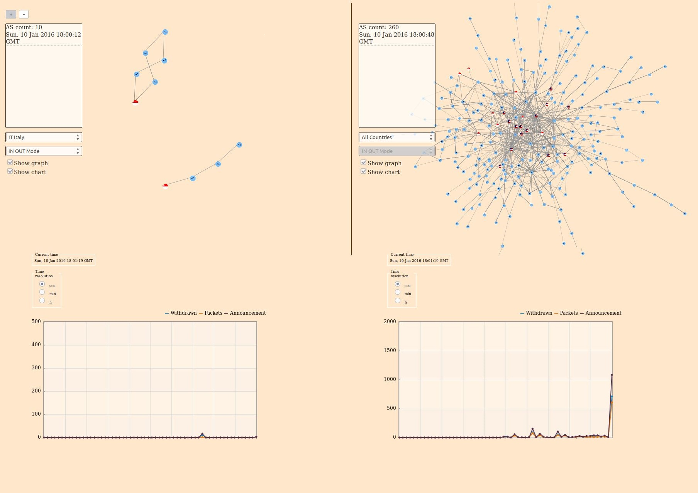

<h1>Overview</h1>

The goal is to provide a service that allows clients to show the Internet topology at AS-level.

<h1>Server</h1>

It was developed, at server side, an engine that downloads (by cUrl) BGP Updates, in MRT format, from various Route Collecting projects (RouteViews,  Isolario and RIS) and sends them to clients by WebSocket.
The MRT Data Reader and Geolocator were provided by IIT-CNR Pisa.

<h1>Client</h1>

 While, at client side, it was developed a Javascript program that receives BGP data and so shows the Internet topology's AS-level graph.
 For the graph creation we have used the VivaJS library.
 
 <h1>Screenshots</h1>

 
 
